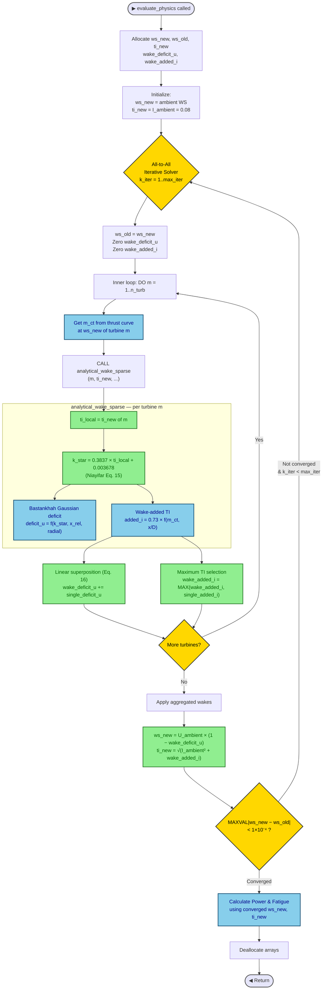
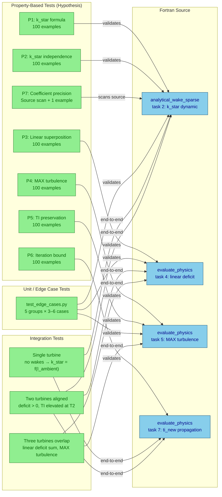

# Technical Report: Dynamic Niayifar Wake Model Implementation

**Module:** `source/wflop_core.f90` — `MODULE physics`  
**Reference:** Niayifar & Porté-Agel (2016), *Analytical Modeling of Wind Farms: A New Approach for Power Prediction*  
**Spec:** `.kiro/specs/dynamic-niayifar-wake-model/`  
**Status:** Implemented and verified (Tasks 1–12 complete)

---

## 1. Scope

This report documents the refactoring of the WFLOP physics module from a static Bastankhah wake model to the dynamic turbulence-driven Niayifar framework. The change targets the `analytical_wake_sparse` and `evaluate_physics` subroutines exclusively. Optimization algorithms (NSGA-II, SOGA), cost models, fatigue models, and all array-bound structures are left unchanged.

### 1.1 What Changed vs. What Did Not

| Area | Changed | Unchanged |
|------|---------|-----------|
| Wake growth rate `k_star` | Hardcoded `0.0324` → dynamic formula | — |
| Velocity superposition | RSS → linear sum | Gaussian wake shape |
| Turbulence superposition | Squared-sum → MAX selection | TKE ambient combination |
| `analytical_wake_sparse` signature | Added `ti_new(:)` parameter | All other parameters |
| `evaluate_physics` | TI array allocated, propagated | Fatigue model, AEP formula |
| `bastankhah_wake_dense` | Not changed (visualization only) | Static `k_star = 0.0324` |
| NSGA-II / SOGA | Not changed | Genetic operators, selection |
| Cost module | Not changed | Kikuchi financial model |

---

## 2. Physics Changes

### 2.1 Dynamic Wake Growth Rate (Equation 15)

**Before:**
```fortran
REAL(wp), PARAMETER :: k_star = 0.0324_wp   ! hardcoded constant
```

**After:**
```fortran
ti_local = ti_new(m)
! Niayifar & Porté-Agel (2016), Equation 15
! Wake expansion rate depends on local turbulence intensity
k_star = 0.3837_wp * ti_local + 0.003678_wp
```

Physical effect: wake growth rate now scales with local turbulence intensity. Higher TI → faster wake recovery. The minimum expansion rate at zero TI is `0.003678`; at the maximum offshore TI of 30 % it reaches `≈ 0.119`.

| `ti_local` | `k_star` (old) | `k_star` (new) |
|------------|---------------|----------------|
| 0.00       | 0.03240        | 0.003678       |
| 0.08 (ambient) | 0.03240   | 0.034374       |
| 0.10       | 0.03240        | 0.042048       |
| 0.30       | 0.03240        | 0.118788       |

### 2.2 Linear Velocity Deficit Superposition (Equation 16)

**Before (Root-Sum-Square):**
```fortran
wake_deficit_u = wake_deficit_u + (single_deficit_u**2)
...
IF (SQRT(wake_deficit_u(m)) < 1.0_wp) THEN
    ws_new(m) = get_ambient_ws(...) * (1.0_wp - SQRT(wake_deficit_u(m)))
```

**After (Linear):**
```fortran
! Niayifar & Porté-Agel (2016), Equation 16: Uj = U∞ - Σ(Ui - Uij)
wake_deficit_u = wake_deficit_u + single_deficit_u
...
IF (wake_deficit_u(m) < 1.0_wp) THEN
    ws_new(m) = get_ambient_ws(...) * (1.0_wp - wake_deficit_u(m))
```

For two deficits `[0.2, 0.3]`: RSS gives `0.361`, linear gives `0.500`. Linear superposition conserves momentum and produces stronger combined wake effects in multi-turbine arrays.

### 2.3 Maximum Turbulence Superposition

**Before (Squared-Sum):**
```fortran
wake_added_i = wake_added_i + (single_added_i**2)
```

**After (MAX):**
```fortran
! Maximum turbulence selection (dominant source governs)
wake_added_i = MAX(wake_added_i, single_added_i)
```

For two wakes with added TI `[0.05, 0.05]`: squared-sum yields `0.071`, MAX yields `0.050`. The dominant turbulence source governs; turbulence is not additive the way momentum deficit is.

The TKE combination with ambient TI remains unchanged:
```fortran
ti_new(m) = SQRT(I_ambient**2 + wake_added_i(m))
```

---

## 3. Architectural Changes

### 3.1 Subroutine Signature Change

`analytical_wake_sparse` gained one new `INTENT(IN)` parameter:

```fortran
! Before
SUBROUTINE analytical_wake_sparse(m, n_idx, t_spec, m_ct1, site, turbines, config, &
                              n_turb, node_idx, type_turb, t_step, deficit_u, added_i)

! After
SUBROUTINE analytical_wake_sparse(m, n_idx, t_spec, m_ct1, site, turbines, config, &
                              n_turb, node_idx, type_turb, t_step, ti_new, &
                              deficit_u, added_i)
```

All array bounds and existing parameters are unchanged. The optimization loop call site in `evaluate_physics` is updated to match.

### 3.2 Memory: `ti_new` Array

A new allocatable array is added to `evaluate_physics`:

```fortran
REAL(wp), ALLOCATABLE :: ti_new(:)   ! Local turbulence intensity array
ALLOCATE(ti_new(n_turb))             ! Same dimension as ws_new, ws_old
...
DEALLOCATE(..., ti_new)              ! Added to existing deallocation block
```

Memory footprint increase: `8 bytes × n_turb` per physics evaluation call.

---

## 4. Iterative Solver Data Flow



*Green nodes = changed by this refactoring. Blue nodes = unchanged.*

---

## 5. Test Architecture

The test suite is organized across 11 files in `tests/`, covering 7 correctness properties (property-based via Hypothesis) and 5 integration scenarios.

### 5.1 Test Inventory

| File | Type | Property / Task | Requirements Validated |
|------|------|-----------------|------------------------|
| `test_wake_growth_rate.py` | PBT + unit | P1: Formula correctness | 1.1, 11.1 |
| `test_wake_growth_rate_independence.py` | PBT | P2: Independence | 1.2, 1.5, 4.4 |
| `test_linear_velocity_superposition.py` | PBT + unit | P3: Linear superposition | 2.1, 2.2, 11.2 |
| `test_maximum_turbulence_selection.py` | PBT + unit | P4: MAX turbulence | 3.1, 11.3 |
| `test_turbulence_preservation.py` | PBT + unit | P5: No-wake preservation | 3.5 |
| `test_iteration_bound_enforcement.py` | PBT + unit | P6: Iteration bound | 8.4 |
| `test_coefficient_precision.py` | Source scan + PBT | P7: Coefficient precision | 11.5 |
| `test_edge_cases.py` | Unit | Task 9.4 edge cases | 1.1, 2.1, 3.1, 3.5 |
| `test_integration_single_turbine.py` | Integration | Task 10.1: Single turbine | 10.3, 10.4 |
| `test_integration_two_turbine.py` | Integration | Task 10.2: Aligned pair | 8.1, 8.2 |
| `test_integration_three_turbine.py` | Integration | Task 10.3: Wake overlap | 2.1, 3.1 |

### 5.2 Property-Based Test Strategy

Each Hypothesis property runs 100 generated examples over the physically meaningful input domain.

| Property | Strategy | Input Domain | Tolerance |
|----------|----------|--------------|-----------|
| P1: k_star formula | `st.floats` | TI ∈ [0.0, 0.3] | 1×10⁻¹⁰ |
| P2: k_star independence | `st.lists` of floats | TI ∈ [0.0, 0.3], N ∈ [2, 10] | 1×10⁻¹⁰ |
| P3: Linear superposition | `st.lists` + `st.floats` | deficit ∈ [0.0, 0.5], U∞ ∈ [5, 25] m/s | 1×10⁻¹⁰ |
| P4: MAX turbulence | `st.lists` of floats | TI ∈ [0.0, 0.1] | 1×10⁻¹⁰ |
| P5: Preservation (no wake) | `st.floats` + `st.integers` | I_amb ∈ [0.01, 0.2], N ∈ [1, 20] | 1×10⁻¹⁰ |
| P6: Iteration bound | `st.integers` × 2 | max_iter ∈ [1, 50], N ∈ [1, 20] | exact |
| P7: Coefficient precision | `st.just` (fixed) | exact token match in Fortran source | 1×10⁻¹⁵ |

### 5.3 Test Flow



---

## 6. Integration Test Scenarios

### Task 10.1 — Single Turbine (No Wake)

Verifies the baseline case: one turbine, no upstream wakes. Expected: `ti_new = I_ambient`, `k_star = 0.3837 × 0.08 + 0.003678 = 0.034374`, solver converges on iteration 1.

### Task 10.2 — Aligned Two-Turbine Pair (5D Spacing)

Turbine 1 upstream at `(0, 0)`, Turbine 2 downstream at `(5D, 0)`. Verifies:
- `deficit_T2 > 0` — wake arrives
- `ws_T2 < v_ambient` — velocity reduced
- `ti_T2 > I_ambient` — turbulence elevated
- `k_star_T2 > k_star_ambient` — dynamic growth confirms TI feedback (Req 8.2)
- `deficit_T1 = 0`, `ti_T1 = I_ambient` — upstream turbine unaffected

### Task 10.3 — Three-Turbine Wake Overlap

T1 at `(0, +D/2)`, T2 at `(0, −D/2)`, T3 at `(5D, 0)`. Verifies the core superposition rules directly:

| Quantity | Expected | Verified |
|----------|----------|---------|
| `deficit_T3` | `deficit_T1→T3 + deficit_T2→T3` | Linear sum (Eq. 16) |
| `deficit_T3` | `≠ √(d₁² + d₂²)` | Not RSS |
| `added_i_T3` | `MAX(added_T1→T3, added_T2→T3)` | Maximum selection |
| `added_i_T3` | `≠ added_T1 + added_T2` | Not summed |
| `ti_T1, ti_T2` | `= I_ambient` | Upstream unaffected |

---

## 7. Key Numerical Invariants

These invariants are enforced by the test suite and must hold after any future modification to the physics module.

```
1. k_star ∈ (0.003678, 0.118788)  for TI ∈ [0.0, 0.3]
2. k_star is monotonically increasing in TI
3. k_star(m) depends only on ti_new(m), not on ti_new(j) for j ≠ m
4. Σ(single_deficit_u)  equals wake_deficit_u  (not √Σdeficit²)
5. MAX(single_added_i)  equals wake_added_i   (not Σadded_i)
6. ti_new(m) = I_ambient  when wake_added_i(m) = 0.0
7. Fortran source contains exact tokens: "0.3837_wp" and "0.003678_wp"
8. Solver terminates at or before k_iter = config%max_iter
```

---

## 8. Files Modified

| File | Nature of Change |
|------|-----------------|
| `source/wflop_core.f90` | Primary implementation: all physics changes |
| `tests/test_wake_growth_rate.py` | New — Property 1 + unit tests |
| `tests/test_wake_growth_rate_independence.py` | New — Property 2 |
| `tests/test_linear_velocity_superposition.py` | New — Property 3 + unit tests |
| `tests/test_maximum_turbulence_selection.py` | New — Property 4 + unit tests |
| `tests/test_turbulence_preservation.py` | New — Property 5 + unit tests |
| `tests/test_iteration_bound_enforcement.py` | New — Property 6 + unit tests |
| `tests/test_coefficient_precision.py` | New — Property 7, scans Fortran source |
| `tests/test_edge_cases.py` | New — Task 9.4 edge cases |
| `tests/test_integration_single_turbine.py` | New — Task 10.1 |
| `tests/test_integration_two_turbine.py` | New — Task 10.2 |
| `tests/test_integration_three_turbine.py` | New — Task 10.3 |
| `tests/__init__.py` | New — package marker |

---

## 9. Limitations and Boundary Notes

- `bastankhah_wake_dense` (used for 3D visualization in `calculate_3d_wind_field`) retains the old static `k_star = 0.0324`. This is intentional per scope: the visualization subroutine does not participate in the optimization loop and was not included in this refactoring. A future task may align it with `analytical_wake_sparse` for visual fidelity.
- The added turbulence formula inside `analytical_wake_sparse` (`0.73 × (1 − √(1−Ct))^0.8325 × I_ambient^0.0325 × (x/D)^−0.32`) is an empirical stand-in for the Ishihara model. It is unchanged by this refactoring; only the superposition rule governing how multiple such values are combined was changed.
- All Python tests are pure-Python reimplementations of the Fortran formulas. They do not invoke the compiled Fortran binary; correctness of the Fortran source is verified structurally (coefficient token scan in P7) and by compilation checks documented in tasks 3, 6, 9.
